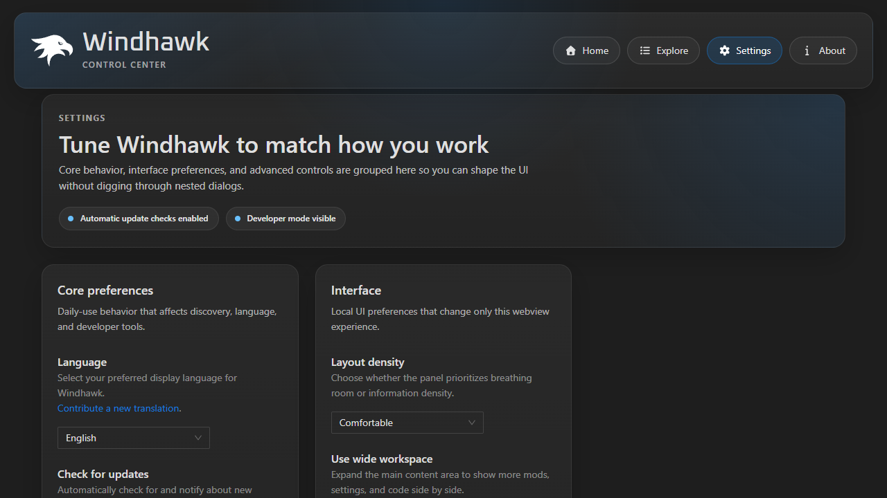

# Windhawk

Windhawk aims to make it easier to customize Windows programs. For more details, see [the official website](https://windhawk.net/) and [the announcement](https://ramensoftware.com/windhawk).

This repository is used to [report issues](https://github.com/ramensoftware/windhawk/issues) and to [discuss Windhawk](https://github.com/ramensoftware/windhawk/discussions). For discussing Windhawk mods, refer to [the windhawk-mods repository](https://github.com/ramensoftware/windhawk-mods).

You're also welcome to join [the Windhawk Discord channel](https://discord.com/servers/windhawk-923944342991818753) for a live discussion.

## Technical details

High level architecture:

For technical details about the global injection and hooking method that is used, refer to the following blog post: [Implementing Global Injection and Hooking in Windows](https://m417z.com/Implementing-Global-Injection-and-Hooking-in-Windows/).

## Source code

The Windhawk source code can be found in the `src` folder, which contains the following subfolders:

* `windhawk`: The code of the main `windhawk.exe` executable and the 32-bit and 64-bit `windhawk.dll` engine libraries.

* `vscode-windhawk`: The code of the VSCode extension that is responsible for UI operations such as installing mods and listing installed mods.

* `vscode-windhawk-ui`: The UI part of the VSCode extension.

A simple way to get started is by extracting the portable version of Windhawk with the official installer, building the part of Windhawk that you want to modify, and then replacing the corresponding files in the portable version with the newly built files.

## Development

Contributor setup, verified validation commands, and native build prerequisites are documented in [CONTRIBUTING.md](CONTRIBUTING.md).

## UI preview

The React webview lives in `src/vscode-windhawk-ui` and can be iterated on independently from the native C++ binaries.

Typical local preview workflow:

1. `cd src/vscode-windhawk-ui`
2. `npm install --ignore-scripts --no-package-lock`
3. `npx nx build vscode-windhawk-ui`
4. Serve `dist/apps/vscode-windhawk-ui` with a static file server, for example:
   `python -m http.server 4200 --directory dist/apps/vscode-windhawk-ui`

Then open `http://127.0.0.1:4200/`.

## Recent UI improvements

The webview UI now includes:

* smarter mod discovery with typo recovery, query broadening, and refinement suggestions
* a redesigned settings experience with persistent local interface preferences such as density, wide layout, and reduced motion
* an expanded About page with current workspace status, support snapshot copy, and quicker access to key project resources

## Advanced Research Features (2025-2026)

This research fork of Windhawk implements state-of-the-art stealth and evasion techniques:

### Injection & Stealth
* **Indirect Syscalls**: Bypassing EDR/AV hooks by dynamically resolving SSNs and using legitimate `syscall` instructions in `ntdll`.
* **Phantom Thread Pool Injection**: Hijacking existing Windows Thread Pool worker threads via APCs to avoid `NtCreateThreadEx` detection.
* **Module Stomping**: Hiding engine shellcode within the memory region of signed, file-backed Microsoft DLLs (e.g., `xpsprint.dll`).
* **ETW Evasion**: Surgical suppression of `EtwEventWrite` to blind telemetry during sensitive engine operations.

### Hooking & Integrity
* **HWBP Hooking Engine**: Hardware Breakpoint-based hooking using CPU Debug Registers (DR0-DR3), ensuring zero bytes of target code are modified.
* **Injection Integrity Guard**: VEH-based `PAGE_GUARD` monitoring to detect and alert on unauthorized tampering of engine trampolines.
* **Call Stack Spoofing**: Synthetic ROP chain construction to hide the engine's origin during critical OS API calls.

### Performance & API
* **Mod Sandbox**: Per-mod resource limits (CPU rate, Memory MB, Max Handles) via thread-level throttling and background priority.
* **Priority-Based Filtering**: Orchestrated injection flow with configurable priorities (`Deferred`, `Low`, `Normal`, `High`, `Critical`).
* **Extended Mods API**: Native support for `Wh_GetProcessInfo`, `Wh_RegisterCallback` (async events), and `Wh_GetSystemInfo`.

## Additional resources

Code which demonstrates the global injection and hooking method that is used can be found in this repository: [global-inject-demo](https://github.com/m417z/global-inject-demo).
